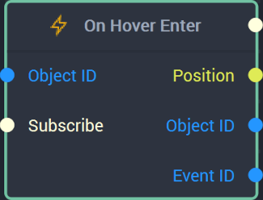

# On Hover Enter

## Overview

**On Hover Enter** is an **Event Listener** **Node** used for executing a **Logic Branch** when the cursor starts hovering over an **Object**.

[**Scope**](../../overview.md#scopes): **Scene**, **Prefab**.

## Inputs

| Input | Type | Description |
| :--- | :--- | :--- |
| `Object ID` | **ObjectID** | The **Object** in which start hovering triggers the **Logic Branch**. |
| `Subscribe` (►)|**Pulse** | An **Input Pulse** that needs to be triggered to start listening to the **Event**. |

## Outputs

| Output | Type | Description |
| :--- | :--- | :--- |
| _Pulse Output_ \(►\) | **Pulse** | A standard **Output Pulse**, to move onto the next **Node** along the **Logic Branch**, once this **Node** has finished its execution. |
| `Position` | **Vector2** | **Vector** containing the XY-coordinates of the point of entry with respect to the bottom left of the **Screen**. |
| `Object ID` | **ObjectID** | The **Object** received as **Input**. |
|`Event ID`| **ObjectID**| The ID of the current **Event**. This can be connected to the [**Unsubscribe Node**](../unsubscribe.md) to unsubscribe from the **Event**.|

## See Also

* [**Events**](../)
* [**Mouse**](./)

## External Links

* [_Mouseover_](https://en.wikipedia.org/wiki/Mouseover) on Wikipedia.

