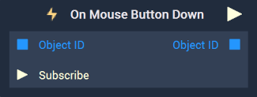
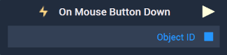
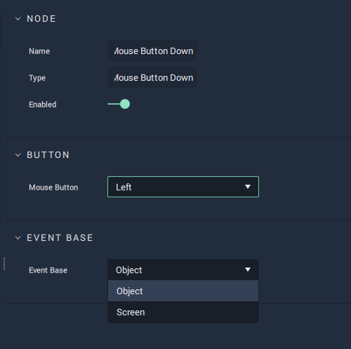

# On Mouse Button Down

## Overview

<!--  -->

<figure><figcaption>
The On Mouse Button Down Node with Object base.
</figcaption></figure>
<figure><figcaption>
The One Mouse Button Down Node with Screen base.
</figcaption></figure>

**On Mouse Button Down** is an **Event Listener** **Node** used for executing a **Logic Branch** when a mouse button is pressed, either on a particular **Object** or anywhere in the **Screen**. This last option is set by the user in the `Event Base` **Attribute**.

[**Scope**](../../overview.md#scopes): **Scene**, **Prefab**.

## Attributes

### Button

| Attribute | Type | Description |
| :--- | :--- | :--- |
| `Mouse Button` | **Drop-down** | Whether the left, middle, or right button of the mouse will trigger the **Logic**. |

### Event Base

| Attribute | Type | Description |
| :--- | :--- | :--- |
| `Event Base` | **Drop-down** | Whether the **Logic** will be triggered when the mouse button is pressed in a particular **Object** or anywhere in the **Screen**.  |

## Inputs

Note: **Input Sockets** only available when `Event Base` is set to `Object`.

| Input | Type | Description |
| :--- | :--- | :--- |
| `Object ID` | **ObjectID** | The **Object** in which a button pressing triggers the **Logic Branch**. |
| `Subscribe` (►)|**Pulse** | An **Input Pulse** that needs to be triggered to start listening to the **Event**. |

## Outputs

| Output | Type | Description |
| :--- | :--- | :--- |
| _Pulse Output_ \(►\) | **Pulse** | A standard **Output Pulse**, to move onto the next **Node** along the **Logic Branch**, once this **Node** has finished its execution. |
| `Object ID` | **ObjectID** | The **Object** received as **Input**. |

## See Also

* [**Events**](../)
* [**Mouse**](./)

