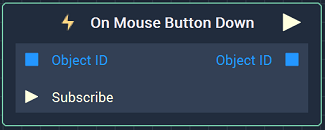
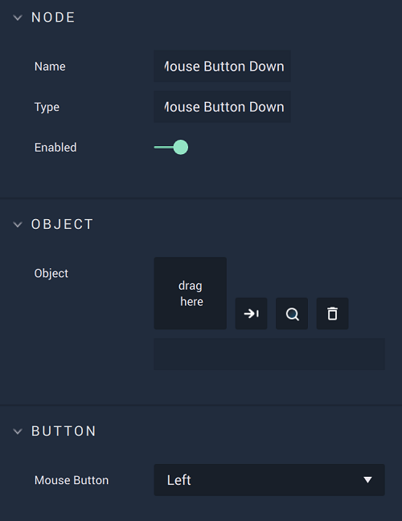

# On Mouse Button Down

## Overview

**On Mouse Button Down** is an **Event Listener** **Node** used for executing a **Logic Branch** when a mouse button is pressed on an **Object**.

*Scope*: **Scene**, **Prefab**

## Attributes

### Object

| Attribute | Type | Description |
| :--- | :--- | :--- |
| `Object` | **ObjectID** | The **Object** in which a button pressing triggers the **Logic Branch**, if none is given in the `Object ID` **Input Socket**. |

### Button

| Attribute | Type | Description |
| :--- | :--- | :--- |
| `Mouse Button` | **Drop-down** | Whether the left, middle, or right button of the mouse will trigger the **Logic**. |

## Inputs

| Input | Type | Description |
| :--- | :--- | :--- |
| `Object ID` | **ObjectID** | The **Object** in which a button pressing triggers the **Logic Branch**. |
| `Subscribe` (►)|**Pulse** | An **Input Pulse** that needs to be triggered to start listening to the **Event**. |

## Outputs

| Output | Type | Description |
| :--- | :--- | :--- |
| _Pulse Output_ \(►\) | **Pulse** | A standard **Output Pulse**, to move onto the next **Node** along the **Logic Branch**, once this **Node** has finished its execution. |
| `Object ID` | **ObjectID** | The **Object** received as **Input**. |

## See Also

* [**Events**](../)
* [**Mouse**](./)

