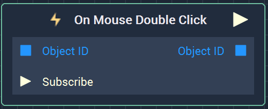
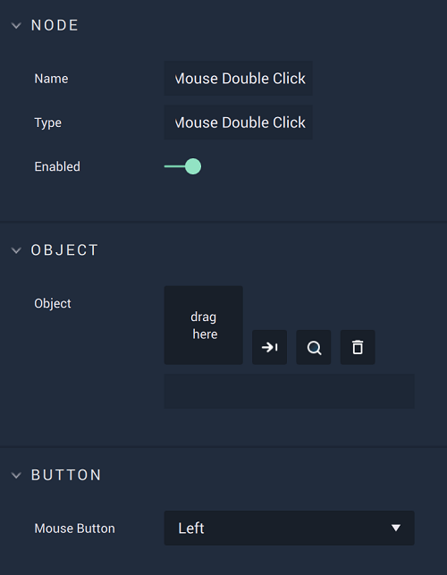

# On Mouse Double Click

## Overview

**On Mouse Double Click** is an **Event Listener** **Node** used for executing a **Logic Branch** when there is a double-click, either on a particular **Object** or anywhere in the **Screen**. 

The **Attributes** allow the user to choose which mouse button will trigger the **Event** and whether the `Event Base` is a specific **Object** or the entire **Screen**.

[**Scope**](../../overview.md#scopes): **Scene**, **Prefab**.

## Attributes

### Button

| Attribute | Type | Description |
| :--- | :--- | :--- |
| `Mouse Button` | **Drop-down** | Whether a double-click with the left, middle, or right button of the mouse will trigger the **Logic**. |

### Event Base

| Attribute | Type | Description |
| :--- | :--- | :--- |
| `Event Base` | **Drop-down** | Whether the **Logic** will be triggered when there is a mouse click on a particular **Object** or anywhere in the **Screen**.  |

## Inputs

Note: **Input Sockets** only available when `Event Base` is set to `Object`.

| Input | Type | Description |
|:--- | :--- | :--- |
| `Object ID` | **ObjectID** | The **Object** in which a double-click triggers the **Logic Branch**. |
| `Subscribe` (►)|**Pulse** | An **Input Pulse** that needs to be triggered to start listening to the **Event**. |

## Outputs

| Output | Type | Description |
| :--- | :--- | :--- |
| _Pulse Output_ \(►\) | **Pulse** | A standard **Output Pulse**, to move onto the next **Node** along the **Logic Branch**, once this **Node** has finished its execution. |
| `Object ID` | **ObjectID** | The **Object ID** of the **Object** that was double-clicked on. If there is no **Object** on that part of the **Screen**, the output is the **Object ID** `00000000-0000-0000-0000-000000000000`. |

## See Also

* [**Events**](../)
* [**Mouse**](./)

