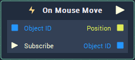

# On Mouse Move

## Overview

**On Mouse Move** is an **Event Listener** **Node** used for executing a **Logic Branch** when the cursor moves within an **Object**.

## Attributes

| Attribute | Type | Description |
| :--- | :--- | :--- |
| `Object` | **ObjectID** | The **Object** in which moving with the cursor triggers the **Logic Branch**, if none is given in the `Object ID` **Input Socket**. |

## Inputs

| Input | Type | Description |
| :--- | :--- | :--- |
|`Object ID` | **ObjectID** | The **Object** in which moving with the cursor triggers the **Logic Branch**. |
| `Subscribe` (►)|**Pulse** | An **Input Pulse** that needs to be triggered to start listening to the **Event**. |

## Outputs

| Output | Type | Description |
| :--- | :--- | :--- |
| _Pulse Output_ \(►\) | **Pulse** | A standard **Output Pulse**, to move onto the next **Node** along the **Logic Branch**, once this **Node** has finished its execution. |
| `Position` | **Vector2** | **Vector** containing the XY-coordinates of the points through which the cursor passes with respect to the bottom left of the **Screen**. |
| `Object ID` | **ObjectID** | The **Object** received as **Input**. |

## See Also

* [**Events**](../)
* [**Mouse**](./)

