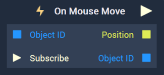

# On Mouse Move

## Overview

**On Mouse Move** is an **Event Listener** **Node** used for executing a **Logic Branch** when the cursor moves either within an **Object** or anywhere in the **Screen**.

The **Attributes** allow the user to choose whether the `Event Base` is a specific **Object** or the entire **Screen**.

[**Scope**](../../overview.md#scopes): **Scene**, **Prefab**.

## Attributes

### Event Base

| Attribute | Type | Description |
| :--- | :--- | :--- |
| `Event Base` | **Drop-down** | Whether the **Logic** will be triggered when the cursor enters a particular **Object** or the **Screen**.  |

## Inputs

Note: **Input Sockets** only available when `Event Base` is set to `Object`.

| Input | Type | Description |
| :--- | :--- | :--- |
|`Object ID` | **ObjectID** | The **Object** in which moving with the cursor triggers the **Logic Branch**. |
| `Subscribe` (►)|**Pulse** | An **Input Pulse** that needs to be triggered to start listening to the **Event**. |

## Outputs

| Output | Type | Description |
| :--- | :--- | :--- |
| _Pulse Output_ \(►\) | **Pulse** | A standard **Output Pulse**, to move onto the next **Node** along the **Logic Branch**, once this **Node** has finished its execution. |
| `Position` | **Vector2** | **Vector** containing the XY-coordinates of the points through which the cursor passes with respect to the bottom left of the **Screen**. |
| `Object ID` | **ObjectID** | The **Object ID** of the **Object** where the cursos moves. If there is no **Object** on that part of the **Screen**, the output is the **Object ID** `00000000-0000-0000-0000-000000000000`.  |

## See Also

* [**Events**](../)
* [**Mouse**](./)

