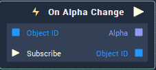

# On Alpha Change

## Overview

**On Alpha Change** is an **Event Listener** **Node** used for executing a **Logic Branch** when the **Alpha** value of an **Object** changes.

## Attributes

| Attribute | Type | Description |
| :--- | :--- | :--- |
| `Object` | **ObjectID** | The **Object** in which a change of the **Alpha** value triggers the **Logic Branch**, if none is given in the `Object ID` **Input Socket**. |

## Inputs

| Input | Type | Description |
| :--- | :--- | :--- |
| `Object ID` | **ObjectID** | The **Object** in which a change of the **Alpha** value triggers the **Logic Branch**. |
| `Subscribe` (►)|**Pulse** | An **Input Pulse** that needs to be triggered to start listening to the **Event**. |

## Outputs

| Output | Type | Description |
| :--- | :--- | :--- |
| _Pulse Output_ \(►\) | **Pulse** | A standard **Output Pulse**, to move onto the next **Node** along the **Logic Branch**, once this **Node** has finished its execution. |
| `Alpha` | **Float** | The modified **Alpha** value. |
| `Object ID` | **ObjectID** | The **Object** received as **Input**. |

## See Also

* [**Events**](../)
* [**Object**](./)
* [**Alpha**](../../../getting-started/attributes/common-attributes/sprite.md#alpha)

