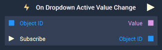

# Overview

The **On Dropdown Active Value Change Node** is an **Event Listener** **Node** used for executing a **Logic Branch** when the current active value of a [**Dropdown Object**](../../../objects-and-types/scene2d-objects/gui/dropdown.md) changes.

[**Scope**](../../overview.md#scopes): **Scene**, **Prefab**.

# Inputs

|Input|Type|Description|
|---|---|---|
|*Pulse Input* (►)|**Pulse**|A standard **Input Pulse**, to trigger the execution of the **Node**.|
|`Object ID`|**ObjectID**| The **Dropdown** in which a change of active value triggers the **Logic Branch**.|
|`Subscribe` (►)|**Pulse**| An **Input Pulse** that needs to be triggered to start listening to the **Event**.  |

# Outputs

|Output|Type|Description|
|---|---|---|
|*Pulse Output* (►)|**Pulse**|A standard **Output Pulse**, to move onto the next **Node** along the **Logic Branch**, once this **Node** has finished its execution.|
|`Value`|**String**| The new active value of the **Dropdown**.|
|`Object ID`|**ObjectID**|The ID of the given **Dropdown Object**.|

# See Also

* [**Set Active Dropdown Value**](../../incari/object/set-active-dropdown-value.md)

