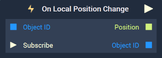
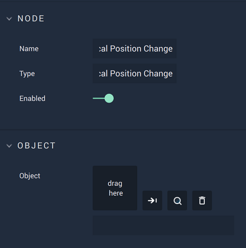

# Overview

The **On Local Position Change Node** is an **Event Listener** **Node** used for executing a **Logic Branch** when the *local position* value of an **Object** changes.

[**Scope**](../../overview.md#scopes): **Scene**, **Prefab**.
 

# Attributes

|Attribute|Type|Description|
|---|---|---|
|`Object`|**ObjectID**|The **Object** in which a change of *local position* triggers the **Logic Branch**, if none is given in the `Object ID` **Socket**.|

# Inputs

|Input|Type|Description|
|---|---|---|
|`Object ID`|**ObjectID**| The **Object** in which a change of *local position* triggers the **Logic Branch**.|
|`Subscribe` (►)|**Pulse**| An **Input Pulse** that needs to be triggered to start listening to the **Event**.  |

# Outputs

|Output|Type|Description|
|---|---|---|
|*Pulse Output* (►)|**Pulse**|A standard **Output Pulse**, to move onto the next **Node** along the **Logic Branch**, once this **Node** has finished its execution.|
|`Position`|**Vector3**| The new local `Position` values of the **Object**.|
|`Object ID`|**ObjectID**|The ID of the returned **Object**.|

# See Also

<!-- * [**Global and Local Transforms**]() -->
* [**Set Local Position**](../../incari/object/set-local-position.md)
* [**Get Local Position**](../../incari/object/get-local-position.md)

## External Links

* [_Position \(geometry\)_](https://en.wikipedia.org/wiki/Position_%28geometry%29) on Wikipedia.