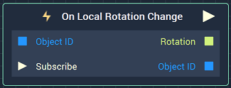
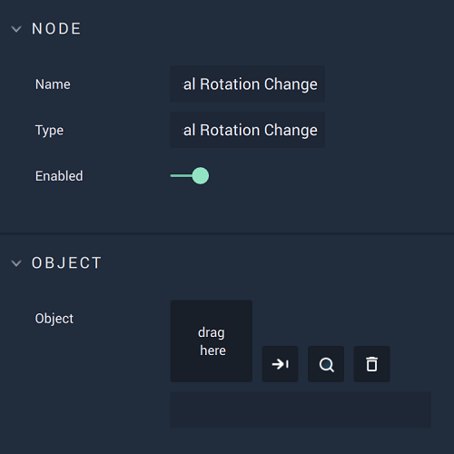

# Overview

The **On Local Rotation Change Node** is an **Event Listener** **Node** used for executing a **Logic Branch** when the 
*local rotation* value of an **Object** changes. 

*Scope*: **Scene**, **Prefab**

# Attributes

|Attribute|Type|Description|
|---|---|---|
|`Object`|**ObjectID**|The **Object** in which a change of *local rotation* values triggers the **Logic Branch**, if none is given in the `Object ID` **Input Socket**.|

# Inputs

|Input|Type|Description|
|---|---|---|
|`Object ID`|**ObjectID**|The **Object** in which a change of *local rotation* values triggers the **Logic Branch**.|
|`Subscribe` (►)|**Pulse**|An **Input Pulse** that needs to be triggered to start listening to the **Event**.|

# Outputs

|Output|Type|Description|
|---|---|---|
|*Pulse Output* (►)|**Pulse**|A standard **Output Pulse**, to move onto the next **Node** along the **Logic Branch**, once this **Node** has finished its execution.|
|`Rotation`|**Vector3**|The returned X, Y, and Z-axis values.|
|`Object ID`|**ObjectID**|The ID of the returned **Object**.|

# See Also

<!-- * [**Global and Local Transforms**]() -->
* [**Set Local Rotation**](../../incari/object/set-local-rotation.md)
* [**Get Local Rotation**](../../incari/object/get-local-rotation.md)

# External Links

* [_Rotation_](https://en.wikipedia.org/wiki/Euler_angles) on Wikipedia