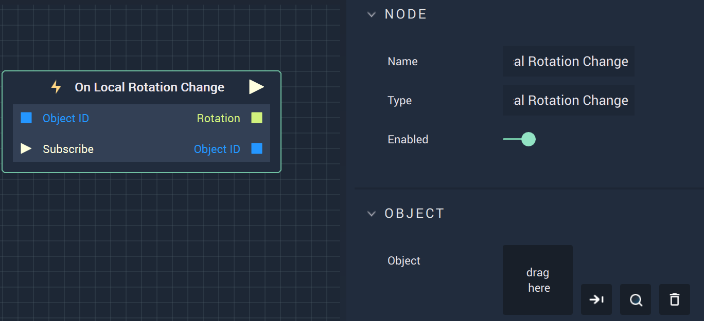

# Overview

The **On Local Rotation Change Node** is an **Event Listener** **Node** used for executing a **Logic Branch** when the *local rotation* value of an **Object** changes.
.

# Attributes

|Attribute|Type|Description|
|---|---|---|
|`Object`|**ObjectID**|The **Object** in which a change of the *local rotation* value triggers the **Logic Branch**.|

# Inputs

|Input|Type|Description|
|---|---|---|
|*Pulse Input* (►)|**Pulse**|A standard **Input Pulse**, to trigger the execution of the **Node**.|
|`Object ID`|**ObjectID**| The ID of the target **Object** which will trigger the change.|
|`Subscribe` (►)|**Pulse**|The **Pulse** to be triggered by previous **Logic**.|

# Outputs

|Output|Type|Description|
|---|---|---|
|*Pulse Output* (►)|**Pulse**|A standard **Output Pulse**, to move onto the next **Node** along the **Logic Branch**, once this **Node** has finished its execution.|
|`Rotation`|**Vector3**|The returned X, Y, and Z-axis values.|
|`Object ID`|**ObjectID**|The ID of the returned **Object**.|

# See Also

