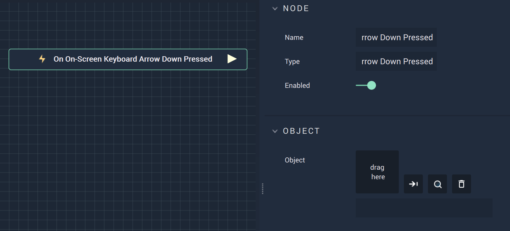

# Overview

The **On On-Screen Keyboard Arrow Down Pressed Node** is an **Event Listener** **Node** used for executing a **Logic Branch** when the `Down` key on the **On-Screen Keyboard** is pressed.

# Attributes

|Attribute|Type|Description|
|---|---|---|
|`Object` | **ObjectID** | The desired **On-Screen Keyboard**. |

# Outputs

|Output|Type|Description|
|---|---|---|
|*Pulse Output* (►)|**Pulse**|A standard **Output Pulse**, to move onto the next **Node** along the **Logic Branch**, once this **Node** has finished its execution.|

# See Also

* [**On On-Screen Keyboard Enter Pressed**](on-onscreen-keyboard-enter-pressed.md)
* [**On On-Screen Keyboard Input Changed**](on-onscreen-keyboard-input-changed.md)
* [**On On-Screen Keyboard Arrow Up Pressed**](ononscreenkeyboardarrowuppressed.md)
* [**On On-Screen Keyboard Key Pressed**](ononscreenkeyboardpressed.md)
