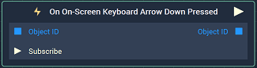
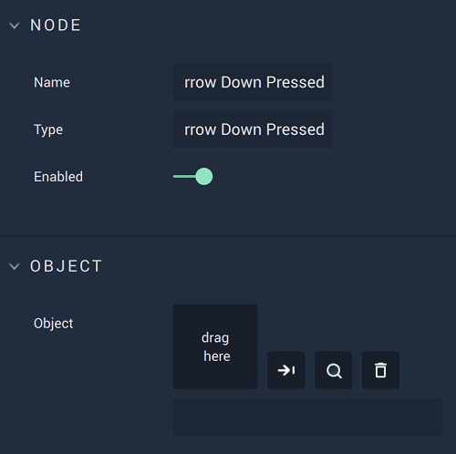

# Overview

The **On On-Screen Keyboard Arrow Down Pressed Node** is an **Event Listener** **Node** used for executing a **Logic Branch** when the `Down` key on the **On-Screen Keyboard** is pressed.

*Scope*: **Scene**, **Prefab**

# Attributes

|Attribute|Type|Description|
|---|---|---|
|`Object` | **ObjectID** | The **On-Screen Keyboard** in which the pressing of the `Down` key triggers the **Logic Branch**, if none is given in the `Object ID` **Input Socket**. |

## Inputs

|Input | Type | Description|
|:---|:---|:---|
|`Object ID`| **ObjectID**| The **On-Screen Keyboard** in which the pressing of the `Down` key triggers the **Logic Branch**. |
| `Subscribe` (►)|**Pulse** | An **Input Pulse** that needs to be triggered to start listening to the **Event**. |

# Outputs

|Output|Type|Description|
|---|---|---|
|*Pulse Output* (►)|**Pulse**|A standard **Output Pulse**, to move onto the next **Node** along the **Logic Branch**, once this **Node** has finished its execution.|
| `Object ID` | **ObjectID** | The **On-Screen Keyboard** received as **Input**. |

# See Also

* [**On On-Screen Keyboard Enter Pressed**](on-onscreen-keyboard-enter-pressed.md)
* [**On On-Screen Keyboard Input Changed**](on-onscreen-keyboard-input-changed.md)
* [**On On-Screen Keyboard Arrow Up Pressed**](ononscreenkeyboardarrowuppressed.md)
* [**On On-Screen Keyboard Key Pressed**](ononscreenkeyboardpressed.md)
