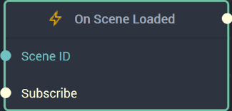

# Overview

The **On Scene Loaded Node** is an **Event Listener** **Node** used for executing a **Logic Branch** when the chosen **Scene** has loaded.

[**Scope**](../../overview.md#scopes): **Project**, **Scene**, **Function**.

# Inputs

|Input|Type|Description|
|---|---|---|
|*Pulse Input* (►)|**Pulse**|A standard **Input Pulse**, to trigger the execution of the **Node**.|
|`Scene ID`|**SceneID**|The ID of the chosen **Scene** that when loaded, triggers the **Logic Branch**.|
| `Subscribe` (►)|**Pulse** | An **Input Pulse** that needs to be triggered to start listening to the **Event**. | 

# Outputs

|Output|Type|Description|
|---|---|---|
|*Pulse Output* (►)|**Pulse**|A standard **Output Pulse**, to move onto the next **Node** along the **Logic Branch**, once this **Node** has finished its execution.|

