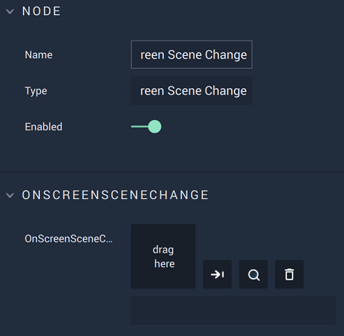

# Overview

The **On Screen Scene Change Node** is an **Event Listener** **Node** used for executing additional **Logic** when the **Scene** of a **Screen** is changed.

# Attributes

|Attribute|Type|Description|
|---|---|---|
|`OnScreenSceneChange`|**Screen**|The **Screen** whose **Scene** change prompts additional **Logic** to fire.

# Outputs

|Output|Type|Description|
|---|---|---|
|*Pulse Output* (►)|**Pulse**|A standard **Output Pulse**, to move onto the next **Node** along the **Logic Branch**, once this **Node** has finished its execution.|
|`Scene ID`|**Scene**|The ID of the changed **Scene**. 

