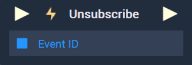

# Overview

The **Unsubscribe Node** allows the user to disconnect, or unsubscribe, from an **Event**. It requires the ID of the **Event** the user wishes to unsubscribe from. 

[**Scope**](../overview.md#scopes): **Scene**, **Function**, **Prefab**.

# Inputs

|Input|Type|Description|
|---|---|---|
|*Pulse Input* (►)|**Pulse**|A standard **Input Pulse**, to trigger the execution of the **Node**.|
|`Event ID`| **ObjectID**|The ID of the **Event** the user wishes to unsubscribe from.|

# Outputs

|Output|Type|Description|
|---|---|---|
|*Pulse Output* (►)|**Pulse**|A standard **Output Pulse**, to move onto the next **Node** along the **Logic Branch**, once this **Node** has finished its execution.|

## Example Usage

The following example shows how to properly configure the **Unsubscribe Node** with an **Event**. 

