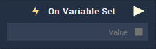

# On Variable Set

## Overview

**On Variable Set** is an **Event Listener Node** used for executing a **Logic Branch** when the value of the corresponding **Variable** is set.

## Outputs

| Output | Type | Description |
| :--- | :--- | :--- |
| _Pulse Output_ \(►\) | **Pulse** | A standard **Output Pulse**, to move onto the next **Node** along the **Logic Branch**, once this **Node** has finished its execution. |
| `Value` | _**Data Type** of the **Variable**_ | The value of the **Variable**. |

## See Also

* [**Variables**](./)

