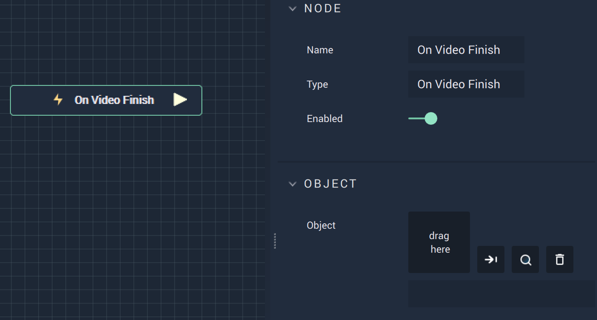

# On Video Finish

## Overview

**On Video Finish** is an **Event Listener Node** that gives the user a way to perform an action once a video ends, such as repeating the video when it is finished. The video can be added through the file library to the right.

## Attributes

| Attribute | Type | Description |
| :--- | :--- | :--- |
| `Object` | **ObjectID** | The target **Object**. |

## Outputs

| Output | Type | Description |
| :--- | :--- | :--- |
| _Pulse Output_ \(►\) | **Pulse** | A standard **Output Pulse**, to move onto the next **Node** along the **Logic Branch**, once this **Node** has finished its execution. |

# See Also
* [On Video Play](onvideoplay.md)
* [Video](README.md)
* [Events](toolbox/events/README.md)