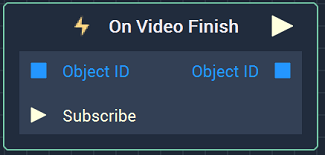
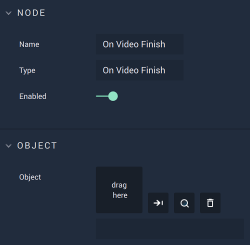

# On Video Finish

## Overview

**On Video Finish** is an **Event Listener Node** that gives the user a way to perform an action once a video ends, such as repeating the video. The video can be added through the file library to the right.

*Scope*: **Scene**, **Prefab**

## Attributes

| Attribute | Type | Description |
| :--- | :--- | :--- |
| `Object` | **ObjectID** | The **Video** that triggers the **Logic Branch** on ending, if none is given in the `Object ID` **Input Socket**.|

## Inputs

| Input | Type | Description|
|:---|:---|:---|
|`Object ID`| **ObjectID**| The **Video** that triggers the **Logic Branch** on ending.|
| `Subscribe` (►)|**Pulse** | An **Input Pulse** that needs to be triggered to start listening to the **Event**. |

## Outputs

| Output | Type | Description |
| :--- | :--- | :--- |
| _Pulse Output_ \(►\) | **Pulse** | A standard **Output Pulse**, to move onto the next **Node** along the **Logic Branch**, once this **Node** has finished its execution. |
|`Object ID`| **ObjectID** | The **Video** received as **Input**. |

## See Also

* [**On Video Play**](onvideoplay.md)
* [**Video**](./)
* [**Events**](../)

