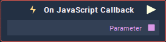

# On Javascript Callback

## Overview

**On Javascript Callback** .

## Attributes

### Object

| Attribute | Type | Description |
| :--- | :--- | :--- |
| `Object` | **ObjectID** |  |

### Function

| Attribute | Type | Description |
| :--- | :--- | :--- |
| `JS Function Name` | **String** |  |

### Outputs

#### Data Types

| Attribute | Type | Description |
| :--- | :--- | :--- |
| `Parameter` | **Drop-down** |  |

## Outputs

| Output | Type | Description |
| :--- | :--- | :--- |
| _Pulse Output_ \(►\) | **Pulse** | A standard **Output Pulse**, to move onto the next **Node** along the **Logic Branch**, once this **Node** has finished its execution. |
| `Parameter` | _Defined in the `Data Type` **Attribute**_ |  |

## See Also

## External Links

