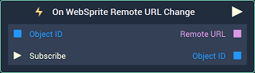
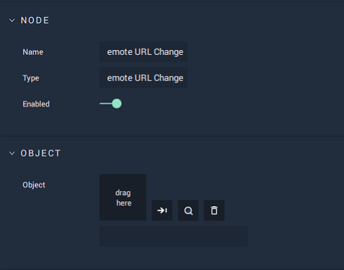

# Overview

**On WebSprite Remote URL Changed** is an **Event Listener** **Node** used for executing a **Logic Branch** when the URL of a **WebSprite** changes.

# Attributes

|Attribute|Type|Description|
|---|---|---|
| `Object` | **ObjectID** | The **WebSprite** **Object** whose URL changing triggers the **Logic Branch**, if none is given in the **Input Socket**. | 

# Inputs

|Input|Type|Description|
|---|---|---|
|*Pulse Input* (►)|**Pulse**|A standard **Input Pulse**, to trigger the execution of the **Node**.|
| `Object ID` | **ObjectID** | The **WebSprite** **Object** whose URL changing triggers the **Logic Branch**. | 
| `Subscribe` (►)|**Pulse** | An **Input Pulse** that needs to be triggered to start listening to the **Event**. |

# Outputs

|Output|Type|Description|
|---|---|---|
|*Pulse Output* (►)|**Pulse**|A standard **Output Pulse**, to move onto the next **Node** along the **Logic Branch**, once this **Node** has finished its execution.|
| `Remote URL` | **String** | The new URL of the **WebSprite** **Object**. |
| `Object ID` | **ObjectID** | The **WebSprite** **Object** whose URL changing triggered the **Logic Branch**. |

# See Also

* [**WebSprite Objects**](../../../objects-and-types/scene-objects/web-sprite.md)
* [**WebSprite Nodes**](../../incari/websprite/README.md)

