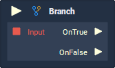

# Overview

**Branch** triggers one of two **Pulses**, based on whether or not the `Input` value is *true* or *false*. Branching is a fundamental part of *conditional logic* and at a high level it basically means "_If this is true, do this; if not, do this_". Although the **Node** takes a single condition, this condition can be composed of multiple other conditions when used in conjunction with *relational expression* **Nodes** (**Is Equal**, **Is Greater Equal**, and **Is Less Equal**), *logical operator* **Nodes** (**AND**, **OR**, and **Negate**), and other **Branch Nodes**.

# Attributes

|Attribute|Type|Description|
|---|---|---|
|`Default Value`|**Bool**|The default value if one is not provided in the `Input` **Input Socket.**|

# Inputs

|Input|Type|Description|
|---|---|---|
|*Pulse Input* (►)|**Pulse**|A standard **Input Pulse**, to trigger the execution of the **Node**.|
|`Input`|**Bool**|The *true* or *false* condition to determine which of the two output **Pulses** are executed.|

# Outputs

|Output|Type|Description|
|---|---|---|
|`OnTrue` (►)|**Pulse**|The **Pulse** will be triggered if `Input` is *true*.|
|`OnFalse` (►)|**Pulse**|The **Pulse** will be triggered if `Input` is *false*.|

# External Links

- [*Conditional (computer programming)*](https://en.wikipedia.org/wiki/Conditional_\(computer_programming\)) on Wikipedia.
ext