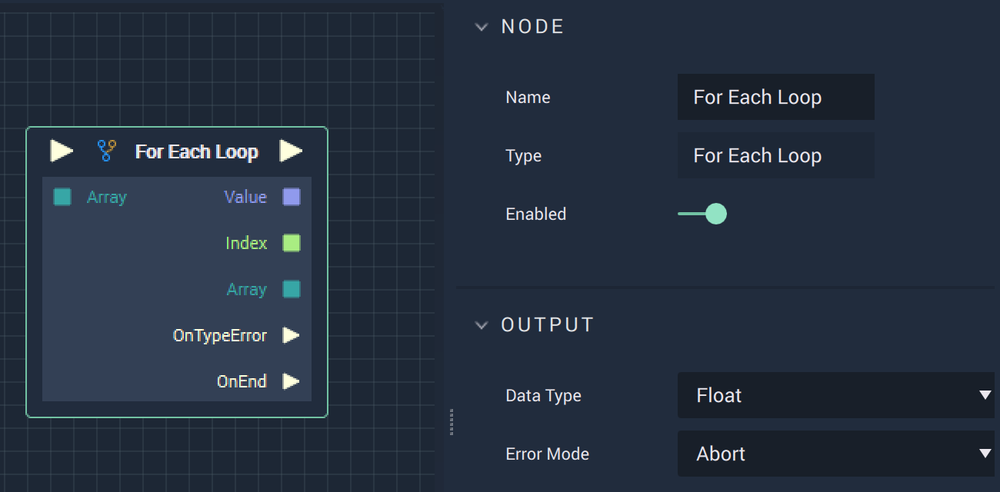

# Overview

The **For Each Loop Node** triggers an iterative process that steps through the provided **Array** input. The output can then, for example, be printed to the **Console** or affect the next **Node** in the **Logic Branch**. 

# Attributes

|Attribute|Type|Description|
|---|---|---|
|`Data Type`|**Dropdown**|The **Variable Type** that populates the **Array**.|
|`Error Mode`|**Dropdown**|The action that takes place if there is an **Error**. The user can choose from **Abort**, **Break**, or **Continue**.|

# Inputs

|Input|Type|Description|
|---|---|---|
|*Pulse Input* (►)|**Pulse**|A standard **Input Pulse**, to trigger the execution of the **Node**.|
|`Array`|**Array**|The referenced **Array**.|

# Outputs

|Output|Type|Description|
|---|---|---|
|*Pulse Output* (►)|**Pulse**|A standard **Output Pulse**, to move onto the next **Node** along the **Logic Branch**, once this **Node** has finished its execution.|
|`Value`|**Variable Type**|The value of a **Variable** in the **Array**, whose type matches the type of the **Array**.|
|`Index`|**Variable Type**|The index of a **Variable** in the **Array**, whose type matches the type of the **Array**.|
|`Array`|**Array**|The referenced **Array**.|
|`OnTypeError` \(►\)|**Pulse**| A **Pulse** that flows to some action that can alert the user of a **Type Error**, such as printing a message to the **Console**.|
|`OnEnd` \(►\)|**Pulse**|A **Pulse** that flows to some action that can alert the user that the loop has ended, such as printing a message to the **Console**.|

# See Also

* [For Loop](forloop.md)

# External Links

* [*For each loop explanation*](https://en.wikipedia.org/wiki/Foreach_loop#:~:text=For%20each%20loops%20are%20almost%20always%20used%20to,flow%20statement%20for%20traversing%20items%20in%20a%20collection.) on Wikipedia.