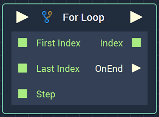
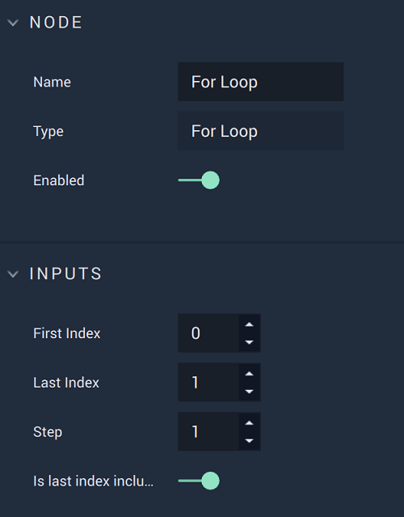

# For Loop

## Overview

The **For Loop Node** triggers an iterative process that steps through the provided **Int** inputs. The output can then, for example, be printed to the **Console** or affect the next **Node** in the **Logic Branch**.

[**Scope**](../overview.md#scopes): **Project**, **Scene**, **Function**, **Prefab**.

## Attributes

| Attribute | Type | Description |
| :--- | :--- | :--- |
| `First Index` | **Int** | The starting index. |
| `Last Index` | **Int** | The stopping index. |
| `Step` | **Int** | The amount to increase or decrease by. |
| `Is Last Index Included` | **Bool** | Notes whether the last index is included or excluded during the iteration. |

## Inputs

| Input | Type | Description |
| :--- | :--- | :--- |
| _Pulse Input_ \(►\) | **Pulse** | A standard **Input Pulse**, to trigger the execution of the **Node**. |
| `First Index` | **Int** | The starting index. |
| `Last Index` | **Int** | The stopping index. |
| `Step` | **Int** | The amount to increase or decrease by. |

## Outputs

| Output | Type | Description |
| :--- | :--- | :--- |
| _Pulse Output_ \(►\) | **Pulse** | A standard **Output Pulse**, to move onto the next **Node** along the **Logic Branch**, once this **Node** has finished its execution. |
| `Index` | **Int** | The output index. |
| `OnEnd`\(►\) | **Pulse** | A **Pulse** that flows to an action, such as a **Console** message, once the **For Loop** has ended. |

## See Also

* [**For Each Loop**](foreachloop.md)

## External Links

* [_For loop explanation_](https://en.wikipedia.org/wiki/For_loop) on Wikipedia.

