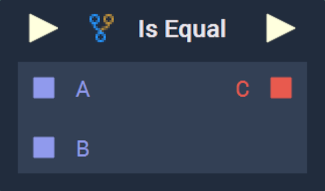
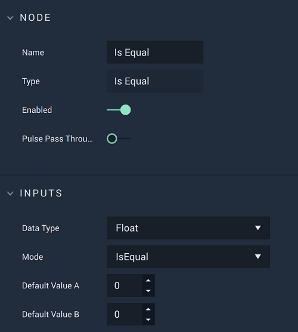

# Is Equal

## Overview

**Is Equal** is a _**Relational Expression**_ **Node**, which compares two input values, and returns a **Boolean**, based on how the two values compare to each other in terms of _equality_. The **Node** has two modes, determined by the `Mode` **Attribute**:

1. `IsEqual` - Are the two values equal in value.
2. `IsNotEqual` - Are the two values _not_ equal in value.

_Relational expressions_ are frequently used in combination with **Branch Nodes** and _logical operator_ **Nodes** ([**AND**](../math/boolean/and.md), [**OR**](../math/boolean/or.md), and [**Negate**](../math/boolean/negate.md)) to create _conditional logic_, and are essential for building complex systems.

[**Scope**](../overview.md#scopes): **Project**, **Scene**, **Function**, **Prefab**.

## Attributes

### Inputs

| Attribute         | Type                                          | Description                                                             |
| ----------------- | --------------------------------------------- | ----------------------------------------------------------------------- |
| `Data Type`       | **Drop-down**                                 | The type of data that will be plugged into the `A` and `B` **Sockets**. |
| `Mode`            | **Drop-down**                                 | The type of expression that will be used when comparing the values.     |
| `Default Value A` | _Defined in the `Data Type`_ _**Attribute**._ | The value of `A` if no value is provided via the **Node's** **Socket**. |
| `Default Value B` | _Defined in the `Data Type`_ _**Attribute**._ | The value of `B` if no value is provided via the **Node's** **Socket**. |

## Inputs

| Input             | Type                                          | Description                                                           |
| ----------------- | --------------------------------------------- | --------------------------------------------------------------------- |
| _Pulse Input_ (►) | **Pulse**                                     | A standard input **Pulse**, to trigger the execution of the **Node**. |
| `A`               | _Defined in the `Data Type`_ _**Attribute**._ | The value to be compared with `B`.                                    |
| `B`               | _Defined in the_ `Data Type` _**Attribute**_  | The value to be compared with `A`.                                    |

## Outputs

| Output             | Type  | Description                                                                                                                                                                                                                                                                                                                       |
| ------------------ | ----- | --------------------------------------------------------------------------------------------------------------------------------------------------------------------------------------------------------------------------------------------------------------------------------------------------------------------------------- |
| _Pulse Output_ (►) | Pulse | A standard output Pulse, to move onto the next Node along the Logic Branch, once this Node has finished its execution.                                                                                                                                                                                                            |
| `C`                | Bool  | 
In <code>IsEqual</code> <code>Mode</code>: Returns <em>true</em> if <code>A</code> is equal to <code>B</code>. If not, then it returns <em>false</em>.

In <code>IsNotEqual</code> <code>Mode</code>: Returns <em>true</em> if <code>A</code> and <code>B</code> are not equal. Otherwise, it returns <em>false</em>.
 |

## External Links

* [_Relational operator_](https://en.wikipedia.org/wiki/Relational\_operator) on Wikipedia.
