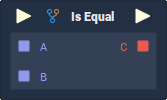

# Is Equal

## Overview

**Is Equal** is a _relational expression_ **Node**, which compares two input values, and returns a **Boolean**, based on how the two values compare to each other in terms of _equality_. The **Node** has two modes, determined by the `Mode` **Attribute**:

1. `IsEqual` - Are the two values equal in value.
2. `IsNotEqual` - Are the two values _not_ equal in value.

_Relational expressions_ are frequently used in combination with **Branch Nodes** and _logical operator_ **Nodes** \([**AND**](https://docs.incari.com/incari-studio/toolbox/math/boolean/and), [**OR**](https://docs.incari.com/incari-studio/toolbox/math/boolean/or), and [**Negate**](https://docs.incari.com/incari-studio/toolbox/math/boolean/negate)\) to create _conditional logic_, and are essential for building complex systems.

## Attributes

| Attribute | Type | Description |
| :--- | :--- | :--- |
| `Data Type` | **Drop-down** | The type of data that will be plugged into the `A` and `B` **Sockets**. |
| `Mode` | **Drop-down** | The type of expression that will be used when comparing the values. |
| `Default Value A` | _Defined in the `Data Type` **Attribute**._ | The value of `A` if no value is provided via the **Node**'s **Socket**. |
| `Default Value B` | _Defined in the `Data Type` **Attribute**._ | The value of `B` if no value is provided via the **Node**'s **Socket**. |

## Inputs

| Input | Type | Description |
| :--- | :--- | :--- |
| _Pulse Input_ \(►\) | **Pulse** | A standard input **Pulse**, to trigger the execution of the **Node**. |
| `A` | _Defined in the `Data Type` **Attribute**._ | The value to be compared with `B`. |
| `B` | _Defined in the_ `Data Type` _**Attribute**_ | The value to be compared with `A`. |

## Outputs

<table>
  <thead>
    <tr>
      <th style="text-align:left">Output</th>
      <th style="text-align:left">Type</th>
      <th style="text-align:left">Description</th>
    </tr>
  </thead>
  <tbody>
    <tr>
      <td style="text-align:left"><em>Pulse Output</em> (&#x25BA;)</td>
      <td style="text-align:left"><b>Pulse</b>
      </td>
      <td style="text-align:left">A standard output <b>Pulse</b>, to move onto the next <b>Node</b> along the <em>logic branch</em>,
        once this <b>Node</b> has finished its execution.</td>
    </tr>
    <tr>
      <td style="text-align:left"><code>C</code>
      </td>
      <td style="text-align:left"><b>Bool</b>
      </td>
      <td style="text-align:left">
        
In <code>IsEqual</code>  <code>Mode</code>: Returns <em>true</em> if <code>A</code> is
          equal to <code>B</code>. If not, then it returns <em>false</em>.

        
In <code>IsNotEqual</code>  <code>Mode</code>: Returns <em>true</em> if <code>A</code> and <code>B</code> are
          not equal. Otherwise, it returns <em>false</em>.

      </td>
    </tr>
  </tbody>
</table>

## External Links

[_Relational operator_](https://en.wikipedia.org/wiki/Relational_operator) on Wikipedia.

