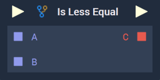
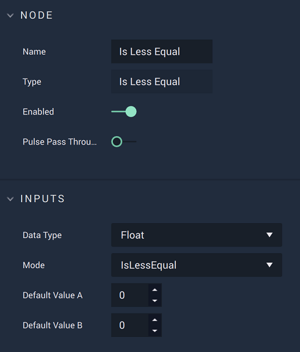

# Is Less Equal

## Overview

**Is Less Equal** is a _**Relational Expression**_ **Node**, which compares two input values, and returns a **Boolean**, based on how the two values compare to each other in terms of _inequality_. The **Node** has two modes, determined by the `Mode` **Attribute**:

1. `IsLess` - Whether the value of `A` is less than the value of `B`.
2. `IsLessEqual` - Whether the value of `A` is less than _or_ equal to the value of `B`.

_Relational expressions_ are frequently used in combination with **Branch Nodes** and _logical operator_ **Nodes** ([**AND**](../math/boolean/and.md), [**OR**](../math/boolean/or.md), and [**Negate**](../math/boolean/negate.md)) to create _conditional logic_, and are essential for building complex systems.

Due to their nature, _inequality_ operations only work for _numerical data types_.

[**Scope**](../overview.md#scopes): **Project**, **Scene**, **Function**, **Prefab**.

## Attributes

| Attribute         | Type                                          | Description                                                             |
| ----------------- | --------------------------------------------- | ----------------------------------------------------------------------- |
| `Data Type`       | **Drop-down**                                 | The type of data that will be plugged into the `A` and `B` **Sockets**. |
| `Mode`            | **Drop-down**                                 | The type of expression that will be used when comparing the values.     |
| `Default Value A` | _Defined in the `Data Type`_ _**Attribute**._ | The value of `A` if no value is provided via the **Node's** **Socket**. |
| `Default Value B` | _Defined in the `Data Type`_ _**Attribute**._ | The value of `B` if no value is provided via the **Node's** **Socket**. |

## Inputs

| Input             | Type                                         | Description                                                           |
| ----------------- | -------------------------------------------- | --------------------------------------------------------------------- |
| _Pulse Input_ (►) | **Pulse**                                    | A standard input **Pulse**, to trigger the execution of the **Node**. |
| `A`               | _Defined in the_ `Data Type` _**Attribute**_ | The value to be compared with `B`.                                    |
| `B`               | _Defined in the_ `Data Type` _**Attribute**_ | The value to be compared with `A`.                                    |

## Outputs

| Output             | Type      | Description                                                                                                                            |
| ------------------ | --------- | -------------------------------------------------------------------------------------------------------------------------------------- |
| _Pulse Output_ (►) | **Pulse** | A standard output **Pulse**, to move onto the next **Node** along the **Logic Branch**, once this **Node** has finished its execution. |
| `C`                | **Bool**  | Returns _true_ if the value of `A` is less than (or equal to, depending on `Mode`) to `B`. If not, then it returns _false_.            |

## External Links

* [_Relational operator_](https://en.wikipedia.org/wiki/Relational\_operator) on Wikipedia.
