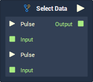
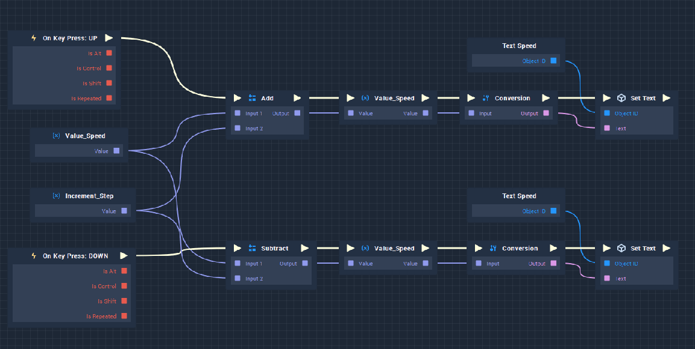
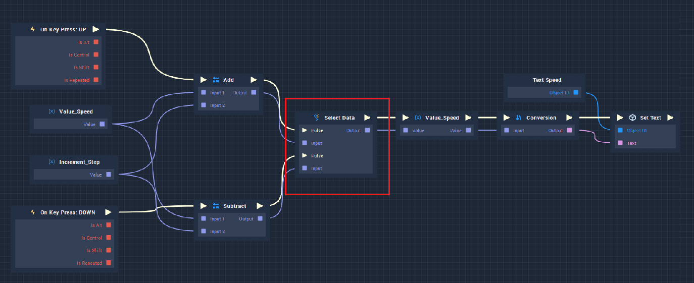

# Select Data

## Overview

Because **Input Data Sockets** in Incari can only receive a value from a single connection, this creates a problem when you wish to converge the logic into a single branch. This is why the **Select Data Node** was created, which takes two or more pairs of **Pulse** and **Data** inputs and outputs the value corresponding to the input **Pulse** that the **Node** was executed by.

## Attributes

| Attribute | Type | Description |
| :--- | :--- | :--- |
| `Data Type` | **Drop-down** | The type of data that will be plugged into the `Input` **Sockets**. |
| `Count` | **Int** | The number of **Input Pulses** and **Data Values** the **Node** will receive. |

## Inputs

| Input | Type | Description |
| :--- | :--- | :--- |
| `Pulse [n]` | **Pulse** | The **Pulse** corresponding to the **Data** in the **Socket** below. |
| `Input [n]` | _Defined in the `Data Type` **Attribute**._ | The **Data Value** corresponding to the above **Pulse**. |

## Outputs

| Output | Type | Description |
| :--- | :--- | :--- |
| _Pulse Output_ \(►\) | **Pulse** | A standard output **Pulse**, to move onto the next **Node** along the _logic branch_, once this **Node** has finished its execution. |
| `Output` | _Defined in the `Data Type` **Attribute**._ | The `Input` value corresponding to whichever `Pulse` triggered the execution of the **Node**. |

## Example Usage

The **Select Data** **Node** is useful for converging several branches of the logic. The following example shows how to use the **Select Data** **Node** to merge two branches of logic into one.

The image above shows two branches that have the same effect (modify a **Text** **Object**) and could be merged into one. For this, the **Select Data** **Node** is introduced:

Here, the two branches have been merged into one, optimizing the logic workflow.