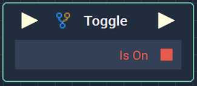
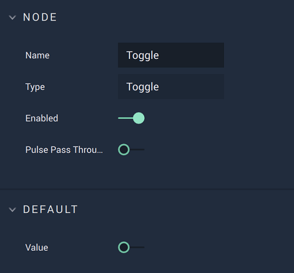

# Toggle

## Overview

The **Toggle Node** holds a **Boolean** _state_, which alternates between _true_ and _false_ every time the input **Pulse** is triggered. This can be thought of as a light switch, which alternates a light bulb's state between being _on_ and _off_.

## Attributes

| Attribute | Type | Description |
| :--- | :--- | :--- |
| `Value` | **Bool** | The default _value_/_state_ of the **Node**, before it is executed. |

## Inputs

| Input | Type | Description |
| :--- | :--- | :--- |
| _Pulse Input_ \(►\) | **Pulse** | A standard input **Pulse**, to trigger the execution of the **Node**. |

## Outputs

| Output | Type | Description |
| :--- | :--- | :--- |
| _Pulse Output_ \(►\) | **Pulse** | A standard output **Pulse**, to move onto the next **Node** along the **Logic Branch**, once this **Node** has finished its execution. |
| `Is On` | **Bool** | Whether or not the _value_/_state_ of the **Node** is currently _true_. |

## External Links

* [_State_](https://www.techopedia.com/definition/696/state-computer-science) on Technopedia.

