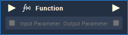
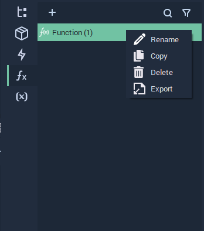
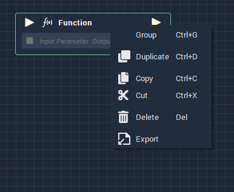

# Function

## Overview

The **Function** **Node** is customized by the user. The number and **Data Types** of the **Input** and **Output** **Sockets** and the functionality are defined in the **Node**'s own **Logic**, which is accessed by either double clicking the **Node** or the **Function** on the **Function**'s list.

The **Node**'s **Logic** has two special **Nodes**: [**Function Input**](function/function-input.md) and [**Function Output**](function/function-output.md).

A **Function** can be exported and then imported in a different **Project**.

## Inputs

| Input | Type | Description |
| :--- | :--- | :--- |
| _Pulse Input_ \(►\) | **Pulse** | A standard **Input Pulse**, to trigger the execution of the **Node**. |
| `Input Parameter [n]` | _Defined in the **Function Input** **Node**_ | Parameter received by the function. |

## Outputs

| Output | Type | Description |
| :--- | :--- | :--- |
| _Pulse Output_ \(►\) | **Pulse** | A standard **Output Pulse**, to move onto the next **Node** along the **Logic Branch**, once this **Node** has finished its execution. |
| `Output Parameter [n]` | _Defined in the **Function Input** **Node**_ | Parameter returned by the function. | 

## Exporting and Importing a **Function**

For exporting a **Function**, right click it on the **Function**'s list or on the **Node**, select Export and save the **Blueprints** file.

For importing a **Function**, right click on the **Function**'s list or on the **Logic Graph**, select Import and find the **Blueprints** file.

