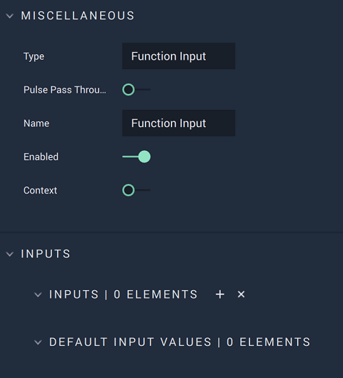

# Function Input

## Overview

In the **Function's** **Logic Graph**, the **Function Input** **Node** starts the **Logic Branch** and outputs the parameter received by the **Function** **Node**.

[**Scope**](../../overview.md#scopes): **Function**. 

## Attributes

### Inputs

| Attribute | Type | Description |
| :--- | :--- | :--- |
| `Input Parameter [n]` | **Drop-down** | Label and **Data Type** for the input parameter of the **Function**. |

### Default Input Values

| Attribute | Type | Description |
| :--- | :--- | :--- |
| `Input Parameter [n]` | _Defined in the **Inputs** **Attribute**_ | Default value of the input parameter. |

## Outputs

| Output | Type | Description |
| :--- | :--- | :--- |
| _Pulse Output_ \(►\) | **Pulse** | A standard **Output Pulse**, to move onto the next **Node** along the **Logic Branch**, once this **Node** has finished its execution. |
| `Input Parameter [n]` | _Defined in the **Inputs** **Attribute**_ | Parameter received by the **Function**. |

## See Also

* [**Function**](./)
* [**Function Output**](function-output.md)

