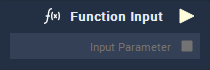

# Overview

**Function Input** .

# Attributes

## Inputs

|Attribute|Type|Description|
|---|---|---|
| `Input Parameter [n]` | **Drop-down** | Label and **Data Type** for the input parameter of the function. |

## Default Input Values

|Attribute|Type|Description|
|---|---|---|
| `Input Parameter` | _Defined in the **Inputs** **Attribute**_ | Default value of the input parameter. | 

# Outputs

|Output|Type|Description|
|---|---|---|
|*Pulse Output* (►)|**Pulse**|A standard **Output Pulse**, to move onto the next **Node** along the **Logic Branch**, once this **Node** has finished its execution.|
| `Input Parameter [n]` | _Defined in the **Inputs** **Attribute**_ | Parameter received by the function. |

