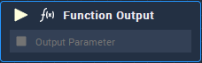

# Overview

In the **Function**'s **Logic Graph**, the **Function Output** **Node** finishes the **Logic Branch** and receives the parameter that the **Function** **Node** will return.

# Attributes

## Outputs

|Attribute|Type|Description|
|---|---|---|
| `Output Parameter [n]` | **Drop-down** | Label and **Data Type** for the output parameter of the function. |

# Inputs

|Input|Type|Description|
|---|---|---|
|*Pulse Input* (►)|**Pulse**|A standard **Input Pulse**, to trigger the execution of the **Node**.|
| `Output Parameter [n]` | _Defined in the **Outputs** **Attribute**_ | Parameter that will be returned by the function. |

# See Also

* [Function](../function.md)
* [Function Input](function-input.md)
