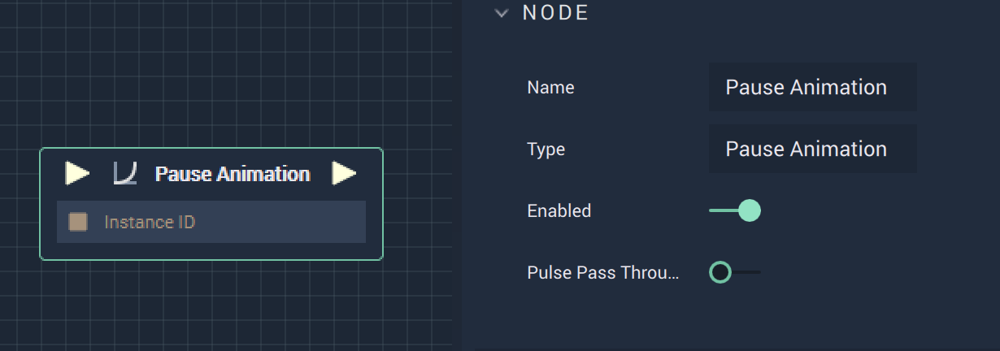

# Pause Animation

## Overview

**Pause Animation** is an _animation_ **Node**  used to pause an **Animation** already playing.

## Attributes

| Attribute | Type | Description |
| :--- | :--- | :--- |
| `Enabled` | **Bool** | A toggle switch that allows the **Node** to be turned on or off |

## Inputs

| Input | Type | Description |
| :--- | :--- | :--- |
| _Pulse Input_ \(►\) | **Pulse** | A standard **Input Pulse**, to trigger the execution of the **Node**. |
| `InstanceID` | **InstanceID** | The assigned **Instance** of an **Animation Block**. |

## Outputs

| Output | Type | Description |
| :--- | :--- | :--- |
| _Pulse Output_ \(►\) | **Pulse** | A standard **Output Pulse**, to move onto the next **Node** along the **Logic Branch**, once this **Node** has finished its execution. |

<<<<<<< Updated upstream
=======
## See Also

* [**Play Animation**](playanimation.md)
* [**Stop Animation**](stopanimation.md)

>>>>>>> Stashed changes
