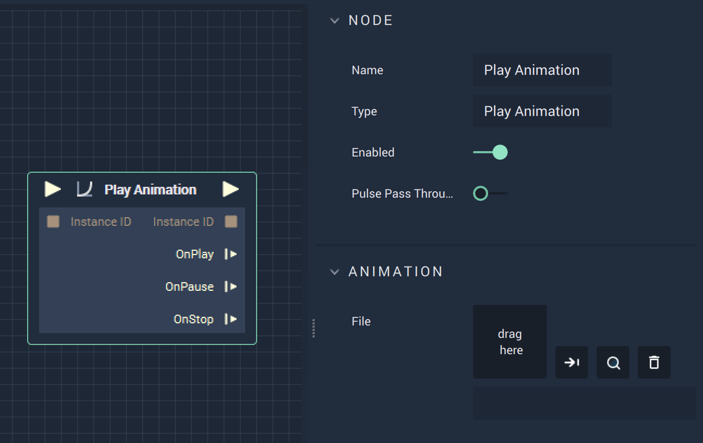
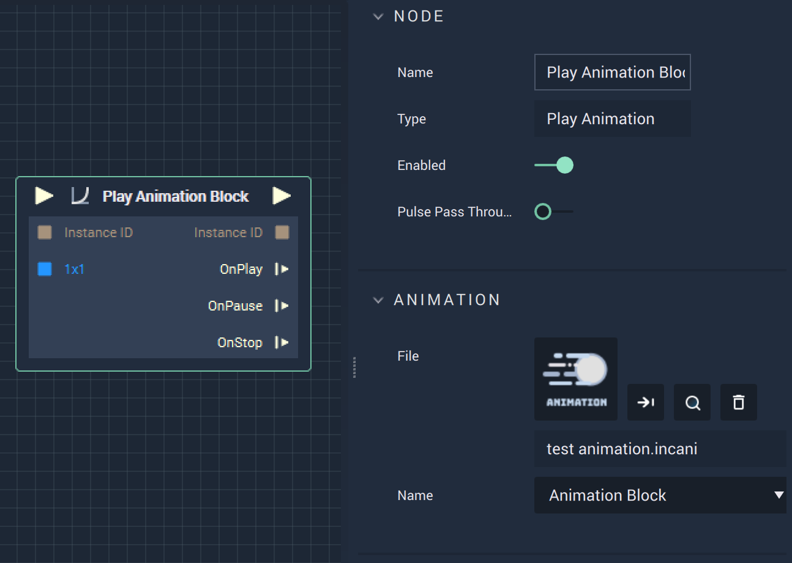

Play Animation:
# Play Animation

## Overview

**Play Animation** is an _animation_ **Node** that can be found under the *incari* **Category**. This **Node** is used to play an **Animation** when the project is run and can be used in conjunction with **Pause Animation** and **Stop Animation**. Once an **Animation** is created in the **Animation Editor Module**, it can be selected in the file selector. A dropdown will appear that allows the user to choose an **Animation Block**. This will show up as a blue-colored input on the **Play Animation Node**.

## Attributes

| Attribute | Type | Description |
| :--- | :--- | :--- |
| `File` | **User Input** | The selected **Animation** file created in the **Animation Editor**. The user can drag a file from their library or select a file from a file tree. The icons to the right allow the user to confirm the selection, highlight the **Asset** in the **Asset Manager**, and remove the selection. |
|`Name`|**Dropdown Menu**|The specified **Animation Block**. These are created in the **Animation Editor**. In the sample image, it is labeled **Animation Block**, but it is useful to name it in relation to the animation purpose.| 

## Inputs

| Input | Type | Description |
| :--- | :--- | :--- |
| _Pulse Input_ \(►\) | **Pulse** | A standard **Input Pulse**, to trigger the execution of the **Node**. |
| _InstanceID_ | **CustomID** | The assigned **Instance** of an **Animation Block**. |

## Outputs

| Output | Type | Description |
| :--- | :--- | :--- |
| _Pulse Output_ \(►\) | **Pulse** | A standard **Output Pulse**, to move onto the next **Node** along the **Logic Branch**, once this **Node** has finished its execution. |
| _InstanceID_ | **CustomID** | The previously assigned **Instance** of the **Animation Block**. |
| _OnPlay_ | **Pulse** | Flows to additional actions following **Play Animation** if the **Animation** is currently playing. |
| _OnPause_ | **Pulse** | Flows to additional actions following **Play Animation** if the animation pauses. |
| _OnStop_ | **Pulse** | Flows to additional actions following **Play Animation** if the animation ends. |