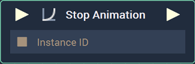

# Stop Animation

## Overview

**Stop Animation** is an **Animation** **Node** used to stop an **Animation** already playing. It receives as input the [**Instance ID**](README.md#instance-id) of the **Animation** to be stopped.

[**Scope**](../../overview.md#scopes): **Scene**, **Function**, **Prefab**.

## Inputs

| Input | Type | Description |
| :--- | :--- | :--- |
| _Pulse Input_ \(►\) | **Pulse** | A standard **Input Pulse**, to trigger the execution of the **Node**. |
| `Instance ID` | **InstanceID** | The [**Instance ID**](README.md#instance-id) of the **Animation** to be stopped.   |

## Outputs

| Output | Type | Description |
| :--- | :--- | :--- |
| _Pulse Output_ \(►\) | **Pulse** | A standard **Output Pulse**, to move onto the next **Node** along the **Logic Branch**, once this **Node** has finished its execution. |

## See Also

* [**Pause Animation**](pauseanimation.md)
* [**Play Animation**](playanimation.md)

