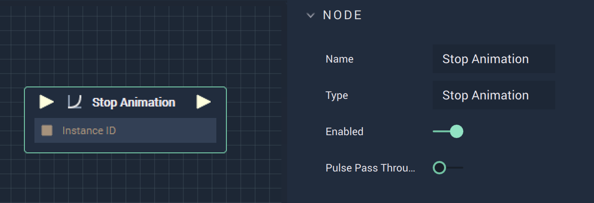

# Stop Animation

## Overview

The **Stop Animation** is an _animation_ **Node** that can be found under **Incari** in the node library. It requires a **CustomID** variable type and allows the user to stop an animation within the session.

## Attributes

| Attribute | Type | Description |
| :--- | :--- | :--- |
| `Enabled` | **Bool** | A toggle switch that allows the **Node** to be turned on or off. |

## Inputs

| Input | Type | Description |
| :--- | :--- | :--- |
| _Pulse Input_ \(►\) | **Pulse** | A standard **Input Pulse**, to trigger the execution of the **Node**. |

## Outputs

| Output | Type | Description |
| :--- | :--- | :--- |
| _Pulse Output_ \(►\) | **Pulse** | A standard **Output Pulse**, to move onto the next **Node** along the **Logic Branch**, once this **Node** has finished its execution. |

