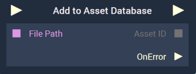

# Overview

The **Add To Asset Database** **Node** adds an **Asset** to the [**Asset Database**](../../../modules/asset-database.md).

If the **Asset** given as input is already in the **Asset Database**, the **Node** simply returns the corresponding **AssetID**.

The **Node** includes an `On Error` **Output Pulse** which gets triggered if there was an error adding the **Asset** to the **Asset Database**. For example, this will get triggered if an invalid *path* is given as input.

[**Scope**](../../overview.md#scopes): **Scene**, **Function**, **Prefab**.

# Inputs

|Input|Type|Description|
|---|---|---|
|*Pulse Input* (►)|**Pulse**|A standard **Input Pulse**, to trigger the execution of the **Node**.|
| `File Path` | **String**  | *Path* to the file to be added to the **Asset Database**. |

# Outputs

|Output|Type|Description|
|---|---|---|
|*Pulse Output* (►)|**Pulse**|A standard **Output Pulse**, to move onto the next **Node** along the **Logic Branch**, once this **Node** has finished its execution.|
| `Asset ID` |**Any** | **ID** of the Asset added to the **Asset Database**. This can then be converted to the corresponding **Data Type** depending on the **Type** of the **Asset**. |
| `On Error`(►) | **Pulse** | **Pulse** that gets triggered when an error occurred and the **Asset** could not be added to the **Asset Database**. |

# See Also

* [**Asset Database**](../../../modules/asset-database.md)

