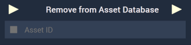

# Overview

The **Remove From Asset Database** **Node** removes an **Asset** from the [**Asset Database**](../../../modules/asset-database.md).

There are two particular cases worth noting:

* If the **Asset** given as input is in use, a warning will be issued.
* If the **Asset** given as input is not in the **Asset Database**, the **Node** will have no effect.

[**Scope**](../../overview.md#scopes): **Scene**, **Function**, **Prefab**.

# Inputs

|Input|Type|Description|
|---|---|---|
|*Pulse Input* (►)|**Pulse**|A standard **Input Pulse**, to trigger the execution of the **Node**.|
| `Asset ID` | **Any** | **ID** of the Asset to be removed from the **Asset Database**. |

# Outputs

|Output|Type|Description|
|---|---|---|
|*Pulse Output* (►)|**Pulse**|A standard **Output Pulse**, to move onto the next **Node** along the **Logic Branch**, once this **Node** has finished its execution.|

# See Also

* [**Asset Database**](../../../modules/asset-database.md)
* [**Add to Asset Database**](add-to-asset-database.md)

