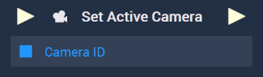

# Overview

The **Set Active Camera** **Node** receives the **Object ID** of a **Camera** and sets that **Camera** as the active one in the **Scene**.

[**Scope**](../../overview.md#scopes): **Scene**, **Prefab**.

# Inputs

|Input|Type|Description|
|---|---|---|
|*Pulse Input* (►)|**Pulse**|A standard **Input Pulse**, to trigger the execution of the **Node**.|
| `Camera ID` | **Object ID** | **Object ID** of the **Camera** that will be set as the active one. |

# Outputs

|Output|Type|Description|
|---|---|---|
|*Pulse Output* (►)|**Pulse**|A standard **Output Pulse**, to move onto the next **Node** along the **Logic Branch**, once this **Node** has finished its execution.|

# See Also

* [**Get Active Camera**](get-active-camera.md)
* [**Camera**](../../../objects-and-types/scene-objects/camera.md)

