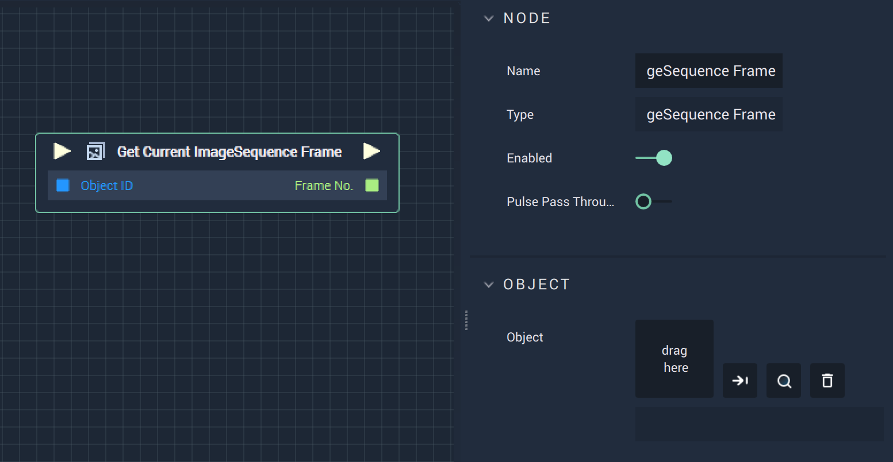

# Overview

The **Get Current ImageSequence Frame Node** returns the current frame number of the selected **ImageSequence**.

# Attributes

|Attribute|Type|Description|
|---|---|---|
|`Object`|**ObjectID**|The target **Object**.|

# Inputs

|Input|Type|Description|
|---|---|---|
|*Pulse Input* (►)|**Pulse**|A standard **Input Pulse**, to trigger the execution of the **Node**.|
|`Object`|**ObjectID**|The ID of the target **Object**.|

# Outputs

|Output|Type|Description|
|---|---|---|
|*Pulse Output* (►)|**Pulse**|A standard **Output Pulse**, to move onto the next **Node** along the **Logic Branch**, once this **Node** has finished its execution.|
|`Frame No.`|**Int**|The **Int** value of the current frame index.|

# See Also

* [**Get ImageSequence Total Frames**](getimagesequencetotalframes.md)
* [**Get ImageSequence Duration**](getimagesequenceduration.md)
* [**Get ImageSequence FPS**](getimagesequencefps.md)

