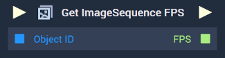
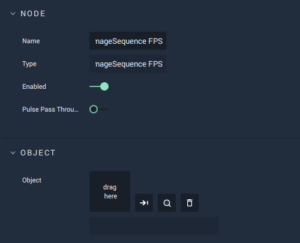

# Get ImageSequence FPS

## Overview

The **Get ImageSequence FPS Node** returns the frame rate of the **ImageSequence**.

[**Scope**](../../overview.md#scopes): **Scene**, **Function**, **Prefab**.

## Attributes

| Attribute | Type | Description |
| :--- | :--- | :--- |
| `Object` | **ObjectID** | The target **Object**. |

## Inputs

| Input | Type | Description |
| :--- | :--- | :--- |
| _Pulse Input_ \(►\) | **Pulse** | A standard **Input Pulse**, to trigger the execution of the **Node**. |
| `Object ID` | **ObjectID** | The ID of the target **Object**. |

## Outputs

| Output | Type | Description |
| :--- | :--- | :--- |
| _Pulse Output_ \(►\) | **Pulse** | A standard **Output Pulse**, to move onto the next **Node** along the **Logic Branch**, once this **Node** has finished its execution. |
| `FPS` | **Int** | The frame rate. |

## See Also

* [**Get ImageSequence Duration**](getimagesequenceduration.md)
* [**Get Current ImageSequence Frame**](getcurrentimagesequenceframe.md)
* [**Get Image Sequence Total Frames**](getimagesequencetotalframes.md)

