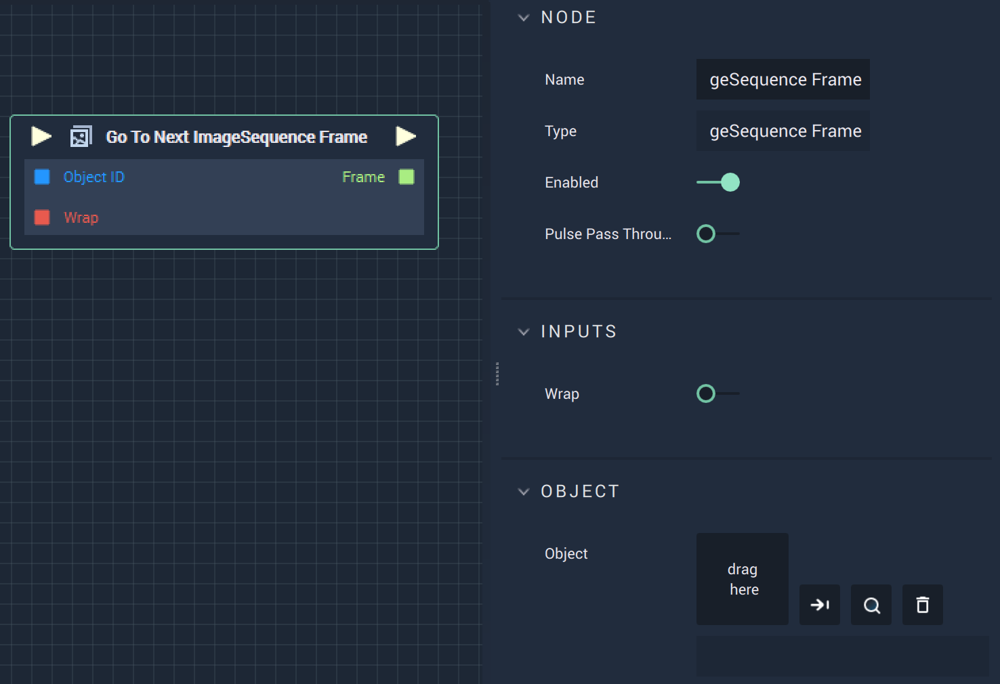

# Overview

The **Go To Next ImageSequence Frame Node** moves forward to the next frame of the **ImageSequence**.

# Attributes

|Attribute|Type|Description|
|---|---|---|
|`Object`|**ObjectID**|The target **Object**.|

# Inputs

|Input|Type|Description|
|---|---|---|
|*Pulse Input* (►)|**Pulse**|A standard **Input Pulse**, to trigger the execution of the **Node**.|
|`Object ID`|**Object**|The ID of the target **Object**.|
|`Wrap`|**Bool**|Set as true or false when the next index of the frame is out of range and whether or not, it should return the next element.|

# Outputs

|Output|Type|Description|
|---|---|---|
|*Pulse Output* (►)|**Pulse**|A standard **Output Pulse**, to move onto the next **Node** along the **Logic Branch**, once this **Node** has finished its execution.|
|`Frame`|**Int**|The index of the next frame.|

# See Also

* [**Go To Previous ImageSequence Frame**](gotopreviousimagesequenceframe.md)