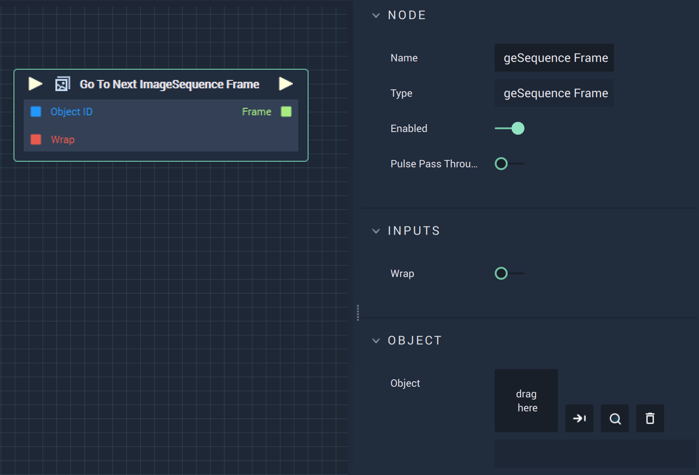

# Go To Previous ImageSequence Frame

## Overview

The **Go To Previous ImageSequence Frame Node** moves backwards to the previous frame of the **ImageSequence**.

## Attributes

| Attribute | Type | Description |
| :--- | :--- | :--- |
| `Object` | **ObjectID** | The target **Object**. |

## Inputs

| Input | Type | Description |
| :--- | :--- | :--- |
| _Pulse Input_ \(►\) | **Pulse** | A standard **Input Pulse**, to trigger the execution of the **Node**. |
| `Object ID` | **ObjectID** | The ID of the target **Object**. |
| `Wrap` | **Bool** | Set as true or false when the previous frame is out of range and whether or not it should return the previous element. |

## Outputs

| Output | Type | Description |
| :--- | :--- | :--- |
| _Pulse Output_ \(►\) | **Pulse** | A standard **Output Pulse**, to move onto the next **Node** along the **Logic Branch**, once this **Node** has finished its execution. |
| `Frame` | **Int** | The index of the previous frame. |

## See Also

* [**Go To Next ImageSequence Frame**](gotonextimagesequenceframe.md)

