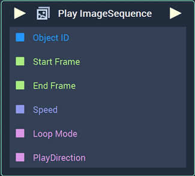
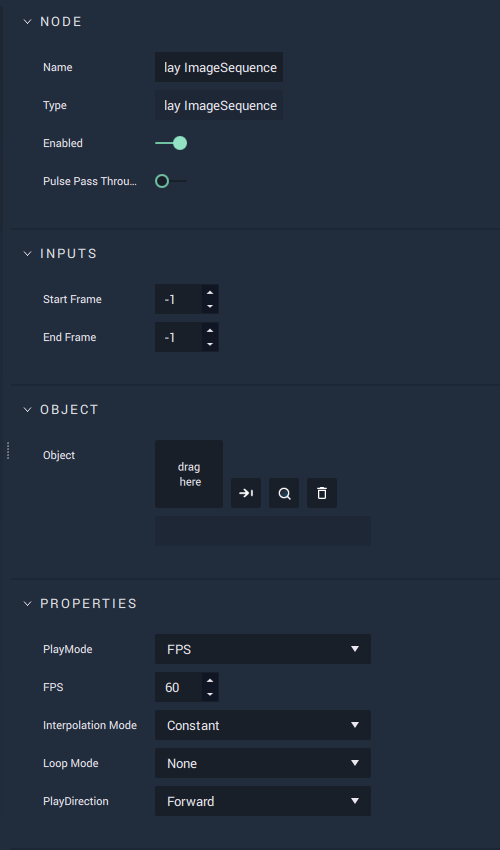

# Play ImageSequence

## Overview

The **Play ImageSequence Node** starts and plays through an **ImageSequence** at the specified time frames.

[**Scope**](../overview.md#scopes):
*  **Scene**, **Function**, **Prefab**

## Attributes

| Attribute | Type | Description |
| :--- | :--- | :--- |
| `Start Frame` | **Int** | The selected start frame. If -1, the start frame is the very first frame of the **ImageSequence**. |
| `End Frame` | **Int** | The selected end frame. If -1, the end frame is the very last frame of the **ImageSequence**. |
| `Object` | **ObjectID** | The target **Object**. |
| `PlayMode` | **Drop-down** | The `PlayMode` type. Can be either _Frames per Second_ \(frame rate\) or _Time_ \(duration\). |
| `FPS` | **Int** | The number of _Frames per Second_. |
| `Interpolation Mode` | **Drop-down** | The `Interpolation Mode` type. Can be either _Constant_ or _Linear_. |
| `Loop Mode` | **Dropdown** | The looping type. Can be _Alternate_, _None_, or _Repeat_. |
| `PlayDirection` | **Dropdown** | The direction in which the **ImageSequence** plays. Can be `Backward` or `Forward`. |

## Inputs

| Input | Type | Description |
| :--- | :--- | :--- |
| _Pulse Input_ \(►\) | **Pulse** | A standard **Input Pulse**, to trigger the execution of the **Node**. |
| `Object ID` | **ObjectID** | The ID of the target **Object**. |
| `Start Frame` | **Int** | The start frame. |
| `End Frame` | **Int** | The end frame. |

## Outputs

| Output | Type | Description |
| :--- | :--- | :--- |
| _Pulse Output_ \(►\) | **Pulse** | A standard **Output Pulse**, to move onto the next **Node** along the **Logic Branch**, once this **Node** has finished its execution. |

## See Also

* [**4 Methods of Animation**](https://docs.incari.com/incari-studio/v/2021.4/demo-projects/4-methods-of-animation#3.-image-sequence)
* [**Pause ImageSequence**](pauseimagesequence.md)
* [**Stop ImageSequence**](stopimagesequence.md)
* [**Resume ImageSequence**](resumeimagesequence.md)

