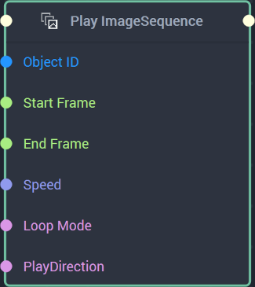
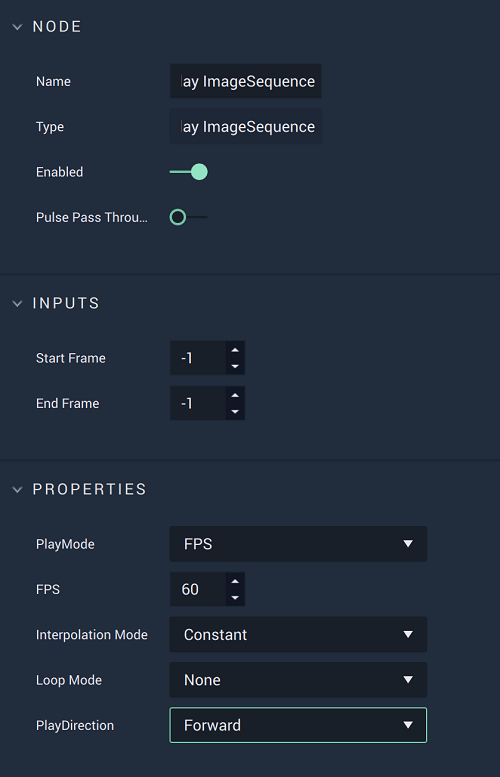

# Play ImageSequence

## Overview

The **Play ImageSequence Node** starts and plays through an **ImageSequence** at the specified time frames. The `Start Frame` value must be a smaller number than the `End Frame`value. When ``PlayDirection` is set to `Backward`, the **ImageSequence** will be played in reverse.  

[**Scope**](../../overview.md#scopes): **Scene**, **Function**, **Prefab**.

## Attributes

| Attribute | Type | Description |
| :--- | :--- | :--- |
| `Start Frame` | **Int** | The selected start frame, if none is received in the **Input Socket**. When set to $$-1$$, the start frame is the very first frame of the **ImageSequence**. Note that it should always be set to a lower value than `End Frame`. |
| `End Frame` | **Int** | The selected end frame, if none is received in the **Input Socket**. When set to $$-1$$, the end frame is the very last frame of the **ImageSequence**. Note that it should always be set to a greater value than `Start Frame`. |
| `PlayMode` | **Drop-down** | The `PlayMode` type. Can be either _Frames per Second_ \(frame rate\) or _Time_ \(duration\). |
| `FPS` | **Int** (when `PlayMode` is set to `FPS`)| The number of _Frames per Second_, if one is not provided in the **Input Socket**. |
|`Duration`|**Float** (when `PlayMode` is set to `Time`)|The duration, in seconds, of the **ImageSequence**, if one is not provided in the **Input Socket**.|
| `Interpolation Mode` | **Drop-down** | The `Interpolation Mode` type. Can be either _Constant_ or _Linear_. |
| `Loop Mode` | **Dropdown** | The looping type, if one is not provided in the **Input Socket**. Can be _Alternate_, _None_, or _Repeat_. |
| `PlayDirection` | **Dropdown** | The direction in which the **ImageSequence** plays, if one is not provided in the **Input Socket**. Can be `Backward` or `Forward`. |

## Inputs

| Input | Type | Description |
| :--- | :--- | :--- |
| _Pulse Input_ \(►\) | **Pulse** | A standard **Input Pulse**, to trigger the execution of the **Node**. |
| `Object ID` | **ObjectID** | The ID of the target **Object**. |
| `Start Frame` | **Int** | The selected start frame. When set to $$-1$$, the start frame is the very first frame of the **ImageSequence**. Note that it should always be set to a lower value than `End Frame`. |
| `End Frame` | **Int** | The selected end frame. When set to $$-1$$, the end frame is the very last frame of the **ImageSequence**. Note that it should always be set to a greater value than `Start Frame`. |
|`Speed`|**Int** or **Float** (depending on selected `PlayMode`)|The *Frames per Second* if `PlayMode` is set to `FPS`. The duration in seconds if `PlayMode` is set to `Time`. 
|`Loop Mode`|**String**|The looping type. Can be _Alternate_, _None_, or _Repeat_. 
|`PlayDirection`|**String**|The direction in which the **ImageSequence** plays. Can be `Backward` or `Forward`.

## Outputs

| Output | Type | Description |
| :--- | :--- | :--- |
| _Pulse Output_ \(►\) | **Pulse** | A standard **Output Pulse**, to move onto the next **Node** along the **Logic Branch**, once this **Node** has finished its execution. |

## See Also

* [**4 Methods of Animation**](https://docs.incari.com/incari-studio/v/2021.4/demo-projects/4-methods-of-animation#3.-image-sequence)
* [**Pause ImageSequence**](pauseimagesequence.md)
* [**Stop ImageSequence**](stopimagesequence.md)
* [**Resume ImageSequence**](resumeimagesequence.md)

