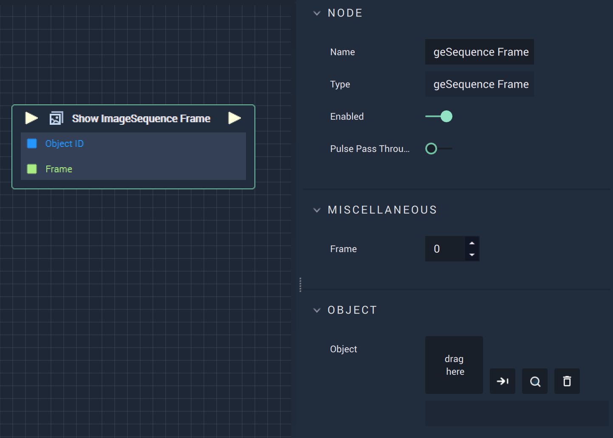

# Overview

**Show ImageSequence Frame** displays the frame at the selected index.

# Attributes

|Attribute|Type|Description|
|---|---|---|
|`Object`|**ObjectID**|The target **Object**.|

# Inputs

|Input|Type|Description|
|---|---|---|
|*Pulse Input* (►)|**Pulse**|A standard **Input Pulse**, to trigger the execution of the **Node**.|
|`Frame`|**Int**|The index of the desired frame. |

# Outputs

|Output|Type|Description|
|---|---|---|
|*Pulse Output* (►)|**Pulse**|A standard **Output Pulse**, to move onto the next **Node** along the **Logic Branch**, once this **Node** has finished its execution.|
