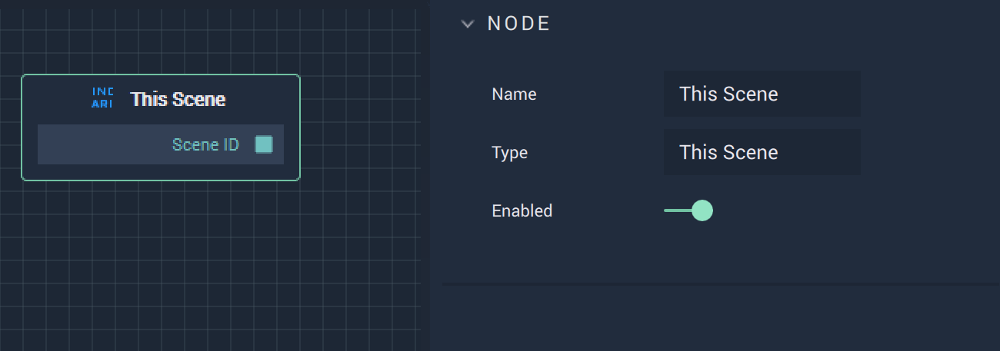

# Overview

The **This Scene Node** provides the ID of the current **Scene** being worked on.

# Outputs

|Output|Type|Description|
|---|---|---|
|`Scene ID`|**CustomID**|The ID of the target **Scene**.|

