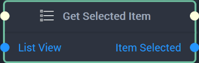

# Overview

The **Get Selected Item Node** returns the item that is currently selected in a **List**.

[**Scope**](../../overview.md#scopes): **Scene**, **Function**, **Prefab**.

# Inputs

|Input|Type|Description|
|---|---|---|
|*Pulse Input* (►)|**Pulse**|A standard **Input Pulse**, to trigger the execution of the **Node**.|
|`List View`|**ObjectID**|The **ID** of the desired **List** whose selected item will be returned.|

# Outputs

|Output|Type|Description|
|---|---|---|
|*Pulse Output* (►)|**Pulse**|A standard **Output Pulse**, to move onto the next **Node** along the **Logic Branch**, once this **Node** has finished its execution.|
|`Item Selected`|**ObjectID**|The selected item in the list.|

