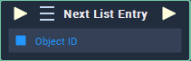

# Overview

**Next List Entry** selects the next entry item in the **List** **Object**.

# Attributes

|Attribute|Type|Description|
|---|---|---|
|`Object`|**ObjectID**|The **List** **Object** which you wish to select the next entry item of. If an **Object** is provided in the `Object ID` **Socket**, this **Attribute** is not used.|

# Inputs

|Input|Type|Description|
|---|---|---|
|*Pulse Input* (►)|**Pulse**|A standard **Input Pulse**, to trigger the execution of the **Node**.|
|`Object ID`|**ObjectID**|The **List** **Object** which you wish to select the next entry item of.|

# Outputs

|Output|Type|Description|
|---|---|---|
|*Pulse Output* (►)|**Pulse**|A standard **Output Pulse**, to move onto the next **Node** along the **Logic Branch**, once this **Node** has finished its execution.|

# Example Usage 

# See Also
- [**List**](objects/scene-objects/list.md)
- [**Generate List**](generate-list.md)
- [**Previous List Entry**](previous-list-entry.md)
